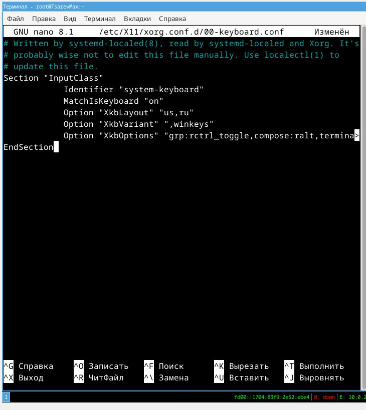

---
## Front matter
title: "Отчет по лабораторной работе №1 "
subtitle: "Дисциплина архитектура компьютера"
author: "Царёв Максим Александрович"

## Generic otions
lang: ru-RU
toc-title: "Содержание"

## Bibliography
bibliography: bib/cite.bib
csl: pandoc/csl/gost-r-7-0-5-2008-numeric.csl

## Pdf output format
toc: true # Table of contents
toc-depth: 2
lof: true # List of figures
fontsize: 12pt
linestretch: 1.5
papersize: a4
documentclass: scrreprt
## I18n polyglossia
polyglossia-lang:
  name: russian
  options:
	- spelling=modern
	- babelshorthands=true
polyglossia-otherlangs:
  name: english
## I18n babel
babel-lang: russian
babel-otherlangs: english
## Fonts
mainfont: IBM Plex Serif
romanfont: IBM Plex Serif
sansfont: IBM Plex Sans
monofont: IBM Plex Mono
mathfont: STIX Two Math
mainfontoptions: Ligatures=Common,Ligatures=TeX,Scale=0.94
romanfontoptions: Ligatures=Common,Ligatures=TeX,Scale=0.94
sansfontoptions: Ligatures=Common,Ligatures=TeX,Scale=MatchLowercase,Scale=0.94
monofontoptions: Scale=MatchLowercase,Scale=0.94,FakeStretch=0.9
mathfontoptions:
## Biblatex
biblatex: true
biblio-style: "gost-numeric"
biblatexoptions:
  - parentracker=true
  - backend=biber
  - hyperref=auto
  - language=auto
  - autolang=other*
  - citestyle=gost-numeric
## Pandoc-crossref LaTeX customization
figureTitle: "Рис."
tableTitle: "Таблица"
listingTitle: "Листинг"
lofTitle: "Список иллюстраций"
lolTitle: "Листинги"
## Misc options
indent: true
header-includes:
  - \usepackage{indentfirst}
  - \usepackage{float} # keep figures where there are in the text
  - \floatplacement{figure}{H} # keep figures where there are in the text
---

# Цель работы

Целью данной работы является приобретение практических навыков установки операционной системы на виртуальную машину, настройки минимально необходимых для дальнейшей работы сервисов.

# Задание

Установка виртуальной машины в virtualbox

# Выполнение лабораторной работы

Создаю машину и запускаю машину

{ #fig:001 width=70% }

Устанавливаю машину на диск

{ #fig:002 width=70% }

{ #fig:004 width=70% }

Устанавливаю средства разработки:

{ #fig:004 width=70% }

sudo dnf -y group install development-tools

Обновляю все пакеты

sudo dnf -y update

Программы для удобства работы в консоли:

sudo dnf -y install tmux mc

{ #fig:005 width=70% }

Автоматическое обновление

Установка программного обеспечения:

sudo dnf -y install dnf-automatic

Задаю необходимую конфигурацию в файле /etc/dnf/automatic.conf.

sudo systemctl enable --now dnf-automatic.timer

{ #fig:006 width=70% }

В файле /etc/selinux/config заменяю значение SELINUX=enforcing на значение SELINUX=permissive

Перегружаю виртуальную машину:

sudo systemctl reboot

{ #fig:007 width=70% }

Создаю конфигурационный файл ~/.config/sway/config.d/95-system-keyboard-config.conf:

mkdir -p ~/.config/sway
touch ~/.config/sway/config.d/95-system-keyboard-config.conf

редактирую конфигурационный файл ~/.config/sway/config.d/95-system-keyboard-config.conf:

{ #fig:008 width=70% }

exec_always /usr/libexec/sway-systemd/locale1-xkb-config --oneshot

Отредактировал конфигурационный файл /etc/X11/xorg.conf.d/00-keyboard.conf:

Section "InputClass"
            Identifier "system-keyboard"
            MatchIsKeyboard "on"
            Option "XkbLayout" "us,ru"
            Option "XkbVariant" ",winkeys"
            Option "XkbOptions" "grp:rctrl_toggle,compose:ralt,terminate:ctrl_alt_bksp"
EndSection

устанавливаю pandoc

{ #fig:009 width=70% }

станавливаю texlive

{ #fig:010 width=70% }

получаю всю информацию о системе

{ #fig:011 width=70% }

# Выводы

Я приобрел практические навыки установки операционной системы на виртуальную машину, настройки минимально необходимых для дальнейшей работы сервисов.

