---
## Front matter
lang: ru-RU
title: Структура научной презентации
subtitle: Простейший шаблон
author:
  - Царёв Максим Александрович
institute:
  - Российский университет дружбы народов, Москва, Россия
  - Объединённый институт ядерных исследований, Дубна, Россия
date: 01 января 1970

## i18n babel
babel-lang: russian
babel-otherlangs: english

## Formatting pdf
toc: false
toc-title: Содержание
slide_level: 2
aspectratio: 169
section-titles: true
theme: metropolis
header-includes:
 - \metroset{progressbar=frametitle,sectionpage=progressbar,numbering=fraction}
---

## Цель работы

Изучить идеологию и применение средств контроля версий.
Освоить умения по работе с git.

## Задание

1. Создать базовую конфигурацию для работы с git.
2. Создать ключ SSH.
3. Создать ключ PGP.
4. Настроить подписи git.
5. Зарегистрироваться на Github.
6. Создать локальный каталог для выполнения заданий по предмету.

## Установка Гит и gh

устноваливаю Гит и gh

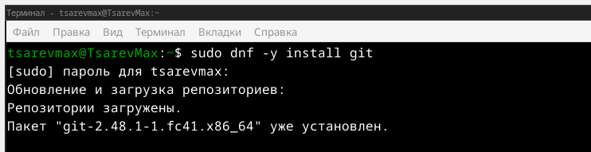{ #fig:001 width=70% }

## Настройка

делаю базовую настройку гита

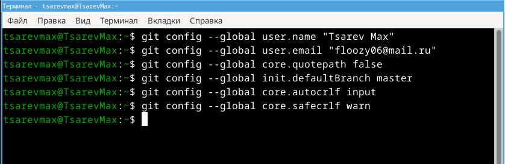{ #fig:002 width=70% }

## Создание ключей

создаю ключи по алгаритму rsa с ключем размером 4096 бит

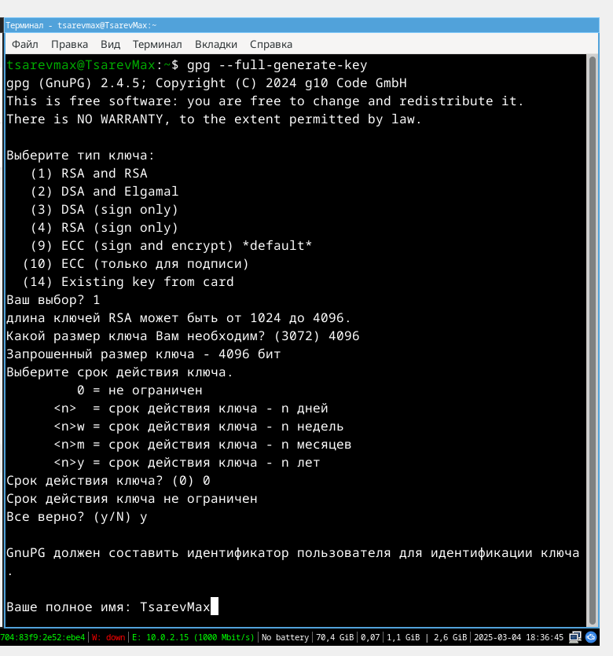{ #fig:006 width=70% }

Пишу фразу-пароль

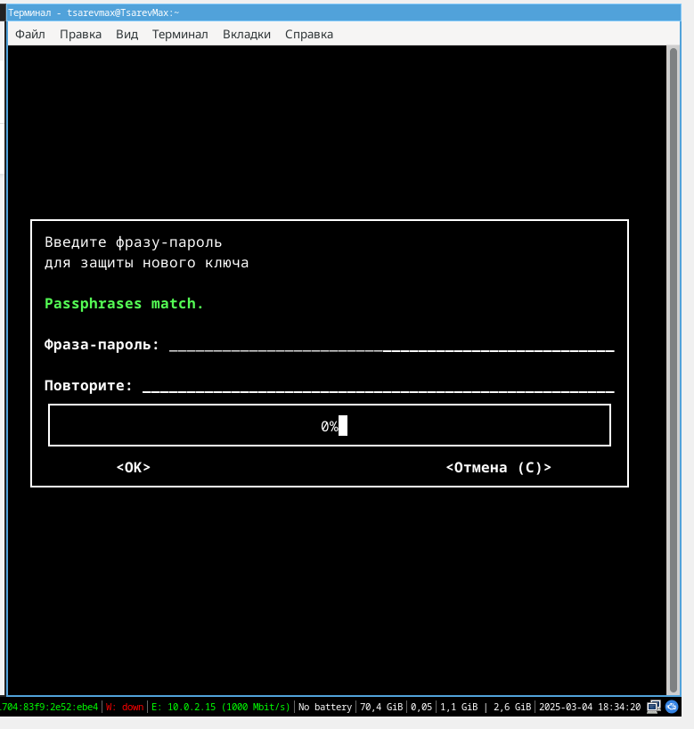{ #fig:005 width=70% }

Выводим список ключей и копируем приватный ключ

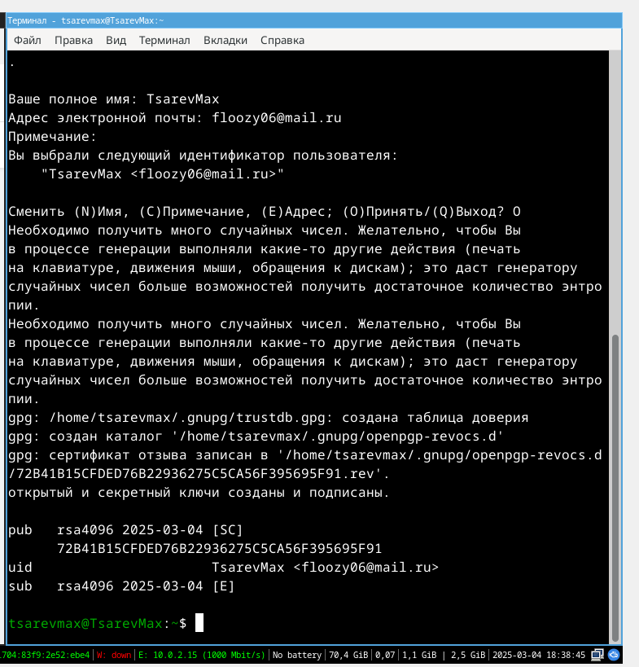{ #fig:007 width=70% }

## Добавление ключей

Захожу на ГитХаб и в настройках добавляю ключ

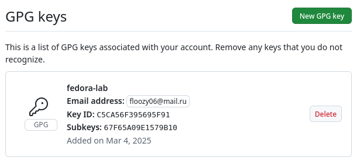{ #fig:008 width=70% }

## Авторизация

Начинаю авторизацию через gh и в конце выбираю авторизоваться через браузер

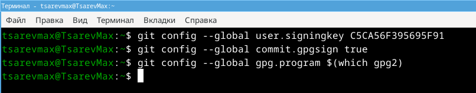{ #fig:009 width=70% }

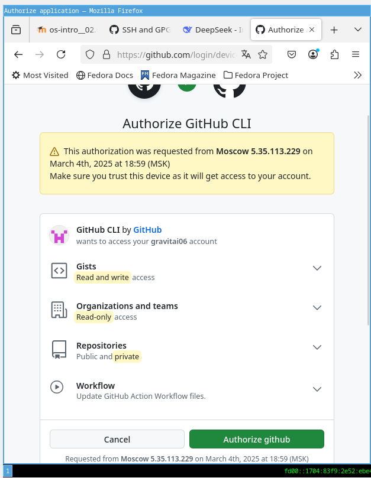{ #fig:010 width=70% }

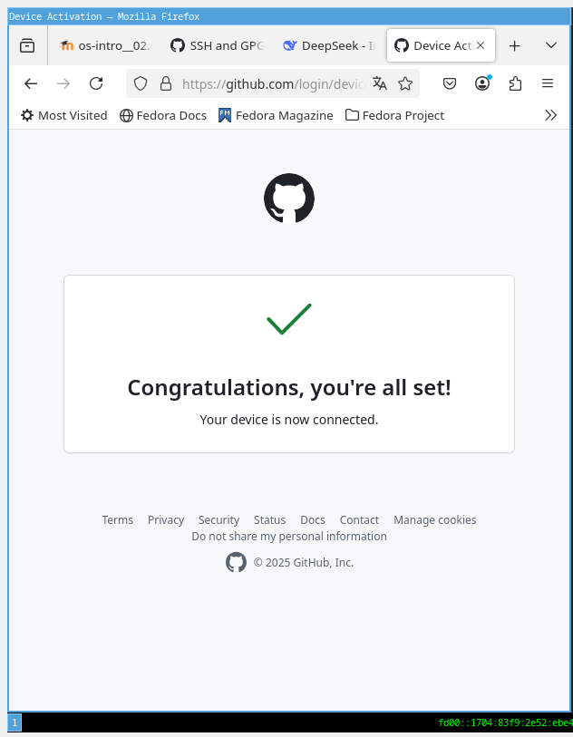{ #fig:011 width=70% }

вижу сообщение об авторизации

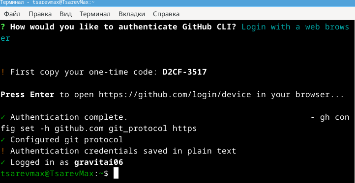{ #fig:012 width=70% }

## Создания репозитория

Создаю репозиторий на основе шаблона

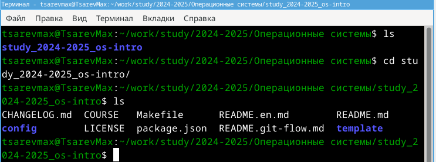{ #fig:013 width=70% }

## Настройка каталога

После созданию репозитория настриваю файлы и в конце пушу в Гит

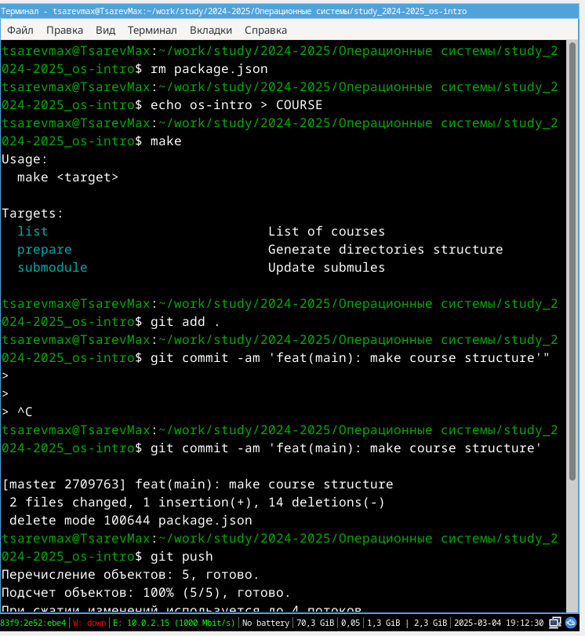{ #fig:014 width=70% }

## Выводы

Я изучил идеологию и применение средств контроля версий. Освоил умения по работе с git.

