---
## Front matter
lang: ru-RU
title: Структура научной презентации
subtitle: Простейший шаблон
author:
  - Кулябов Д. С.
institute:
  - Российский университет дружбы народов, Москва, Россия
  - Объединённый институт ядерных исследований, Дубна, Россия
date: 01 января 1970

## i18n babel
babel-lang: russian
babel-otherlangs: english

## Formatting pdf
toc: false
toc-title: Содержание
slide_level: 2
aspectratio: 169
section-titles: true
theme: metropolis
header-includes:
 - \metroset{progressbar=frametitle,sectionpage=progressbar,numbering=fraction}
---

## Цель работы

Получение навыков правильной работы с репозиторием Гит

## Задание
Выполнить работу для тестового репозитория
Преобразовать рабочий репозиторий в репозиторий git-low and conventional commits

##Установка Gitflow

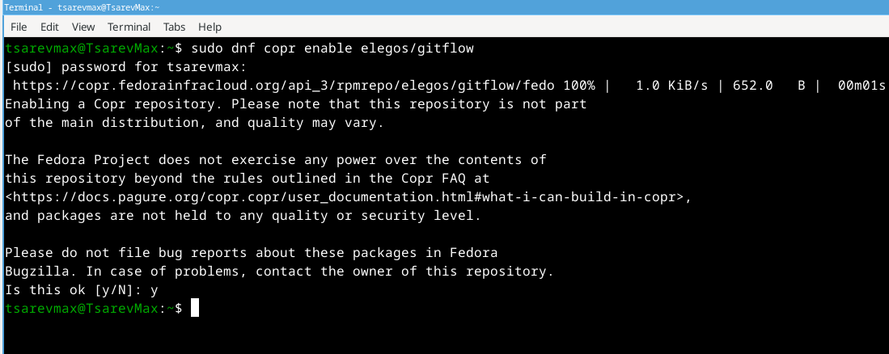{ #fig:001 width=70% }

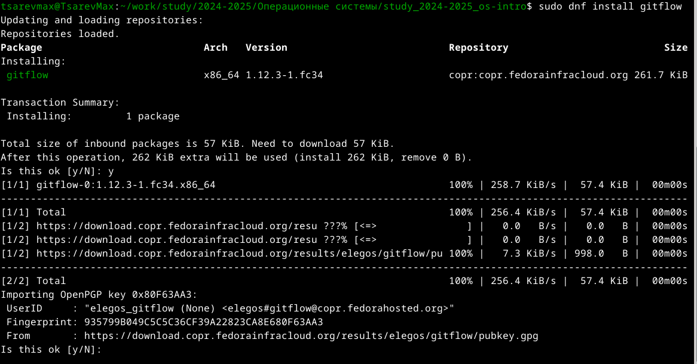{ #fig:002 width=70% }

## устонавливаю Node.js

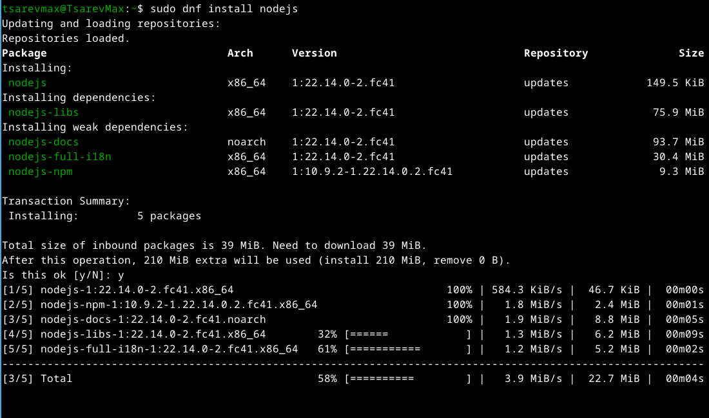{ #fig:003 width=70% }

## Устонавливаю pnpm

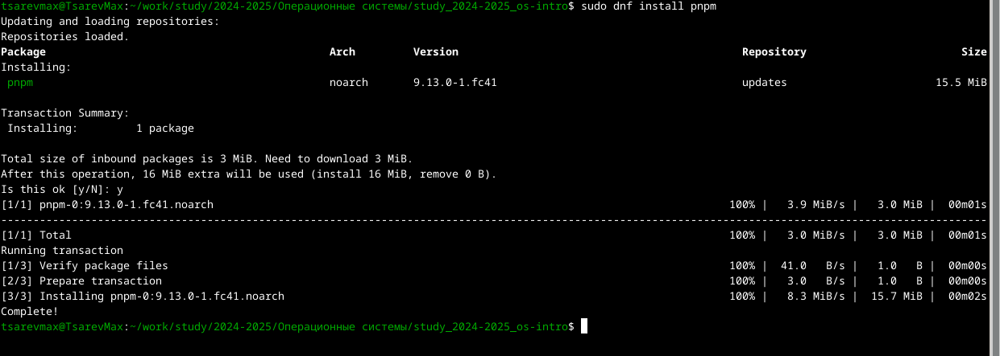{ #fig:004 width=70% }

## Настройка окружения

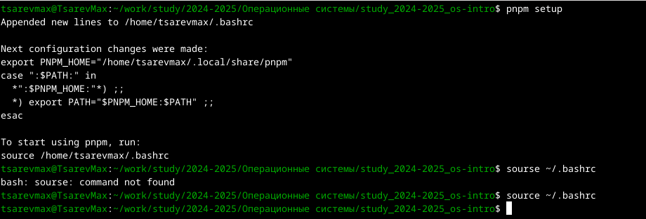{ #fig:005 width=70% }

## Настройка истурменнтов для общепринятых коммитов

Установка commitizen

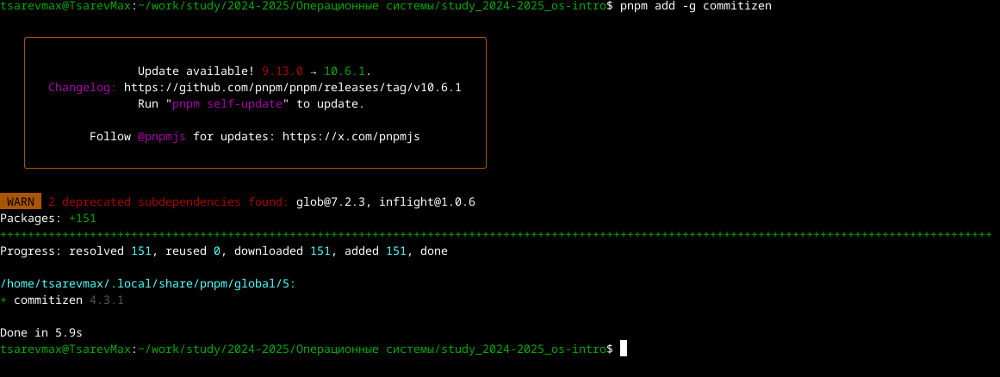{ #fig:006 width=70% }

## Также устоновил стандартный генератор журналов изменений

pnpm add -g standard-changelog

## создаю тестовый репозиторий и клонирую его

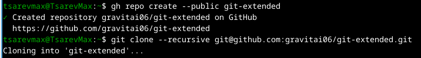{ #fig:007 width=70% }

## создал несколько файлов чтобы был не пустой репозиторий
закоментил и запушил

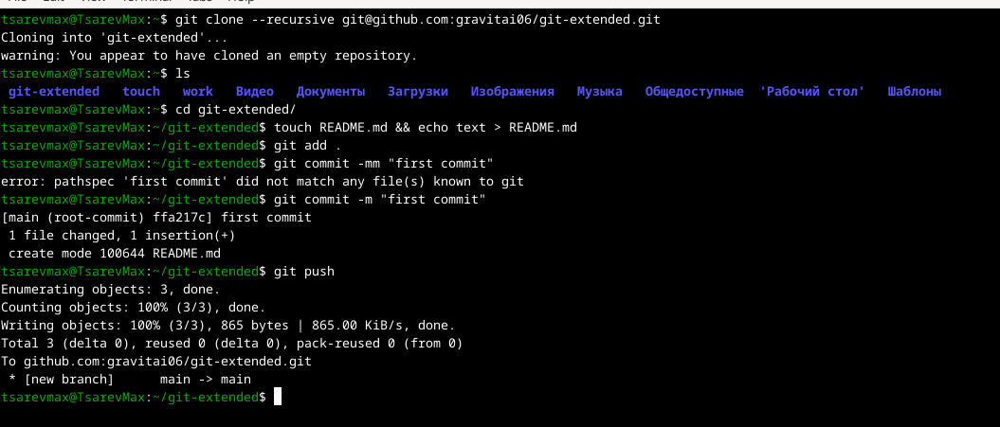{ #fig:008 width=70% }

## Конфигурация для пакетов Node.js

pnpm init

## после изменил файл package.json

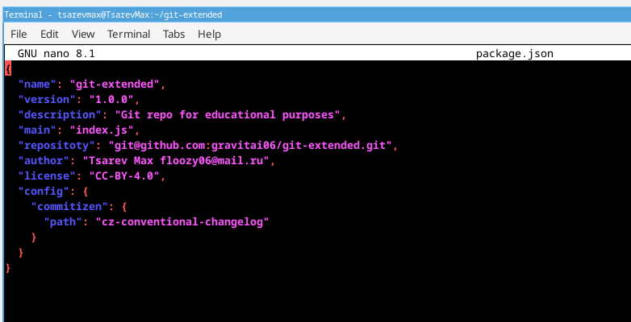{ #fig:009 width=70% }

## создаю ветку девелоп и пушу все туда

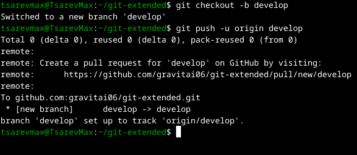{ #fig:010 width=70% }                                    

## добавил файлы в индекс 
сделал коммит и запушил

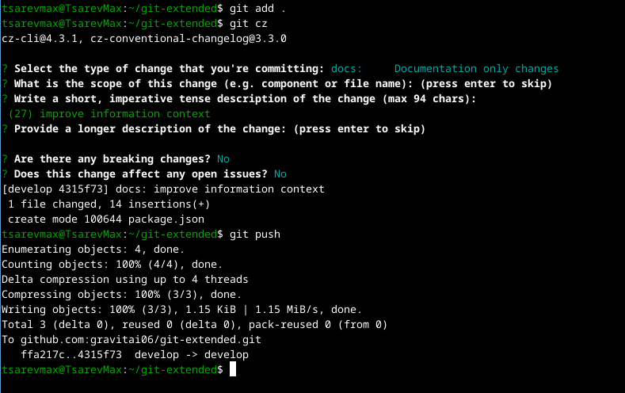{ #fig:011 width=70% }

## Инициализируем git-flow
проверяю ветку и загружаю в репозиторий

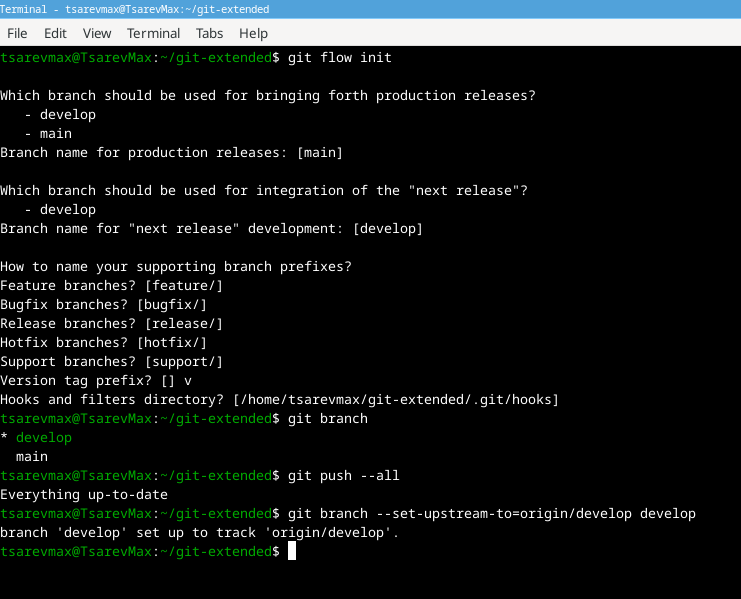{ #fig:012 width=70% }

## Создание релиза

Начал релиз

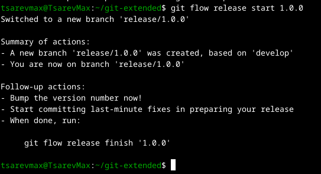{ #fig:013 width=70% }

## создал журнал изменений и добавил в журнал

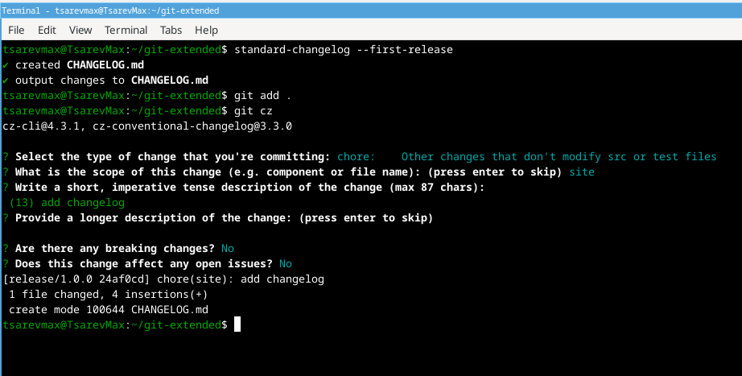{ #fig:014 width=70% }                                    

## Завершил релиз

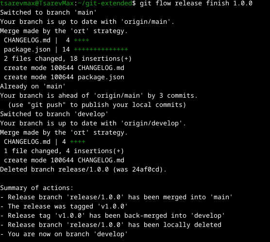{ #fig:015 width=70% }

## отправляю все в репозиторий

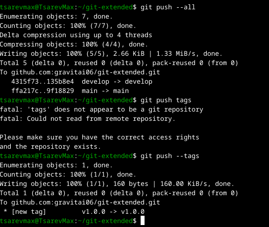{ #fig:016 width=70% }

## создал релиз на гитхабе

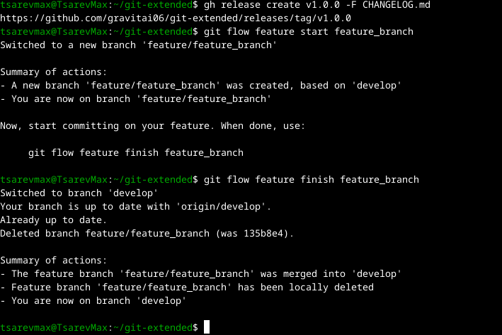{ #fig:017 width=70% }

Работа с ветками

## Начинаю релиз

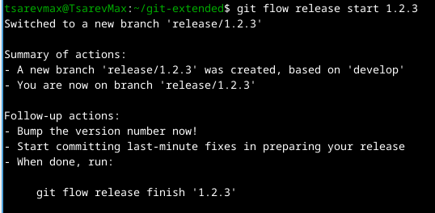{ #fig:018 width=70% }

## Создал журнал изменений и добавил туда
и в конце завершаю релиз

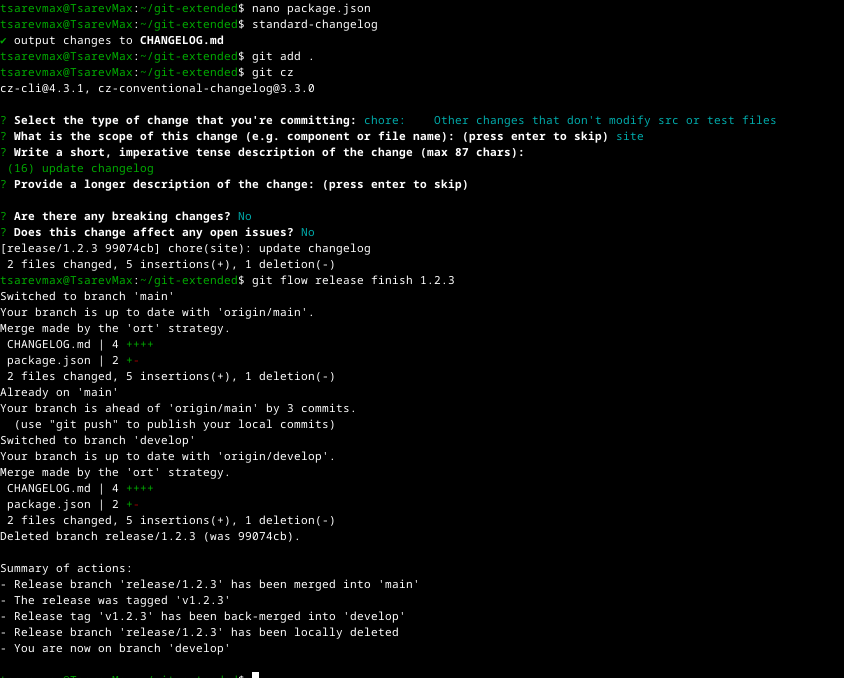{ #fig:019 width=70% }                                    

## отправляю измения в репозиторий и создаю релиз

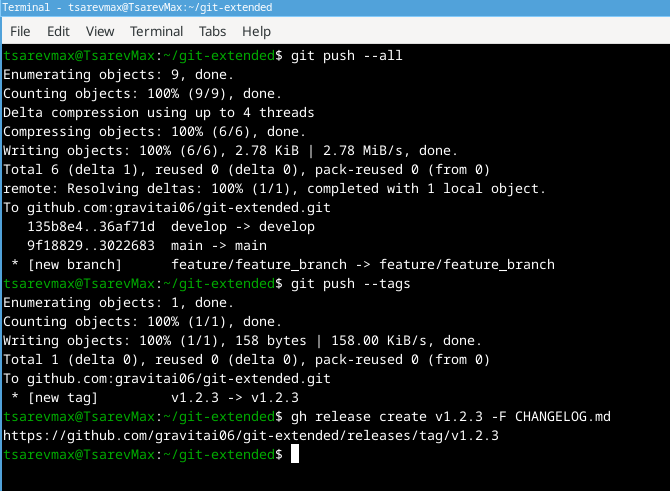{ #fig:020 width=70% }

## Выводы

я получил навыки правильной работы с репозиториями git.
