---
## Front matter
lang: ru-RU
title: Структура научной презентации
subtitle: Простейший шаблон
author:
  - Царёв Максим
institute:
  - Российский университет дружбы народов, Москва, Россия
  - Объединённый институт ядерных исследований, Дубна, Россия
date: 01 января 1970

## i18n babel
babel-lang: russian
babel-otherlangs: english

## Formatting pdf
toc: false
toc-title: Содержание
slide_level: 2
aspectratio: 169
section-titles: true
theme: metropolis
header-includes:
 - \metroset{progressbar=frametitle,sectionpage=progressbar,numbering=fraction}
---

## Цель работы

Познакомиться с pass, gopass, native messaging, chezmoi. Научиться пользоваться этими утилитами, синхронизировать их с гит.

## Задание

1. Установить дополнительное ПО
2. Установить и настроить pass
3. Настроить интерфейс с браузером
4. Сохранить пароль
5. Установить и настроить chezmoi
6. Настроить chezmoi на новой машине
7. Выполнить ежедневные операции с chezmoi

## установка pass

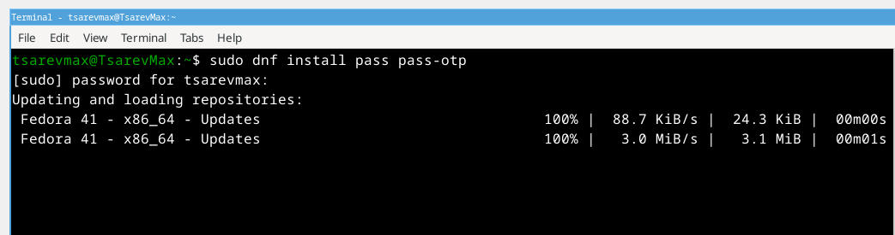{ #fig:001 width=70% }

## установка gopass

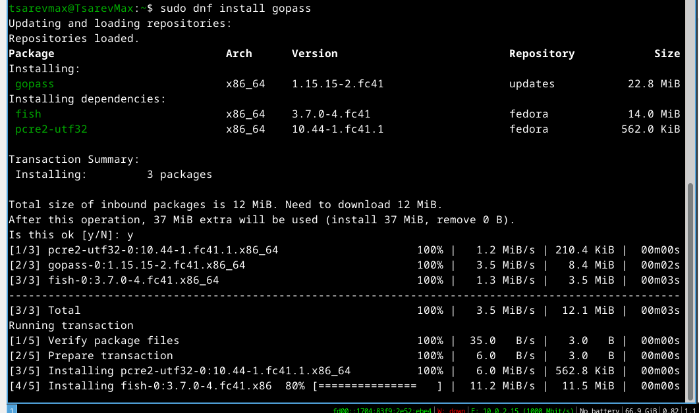{ #fig:002 width=70% }

## Проверка существующих ключей

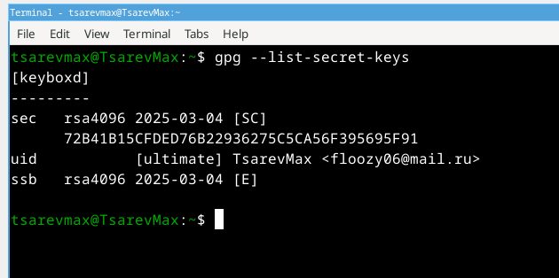{ #fig:003 width=70% }

## инициализация хранилища

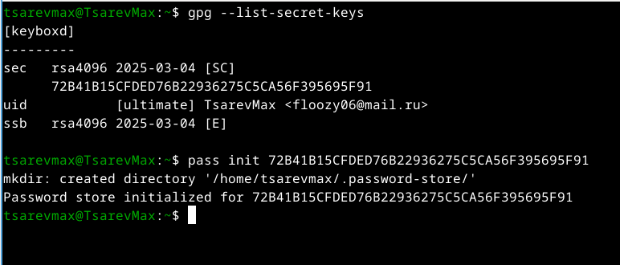{ #fig:004 width=70% }

## создание структуры Гит

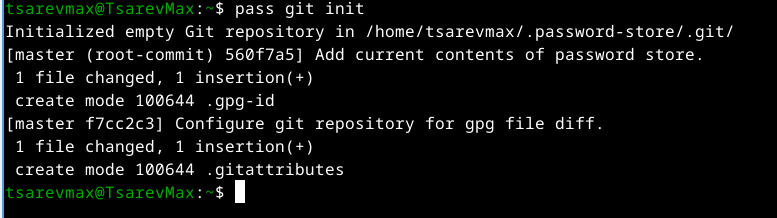{ #fig:005 width=70% }

## предаварительно создал репозиторий на гите

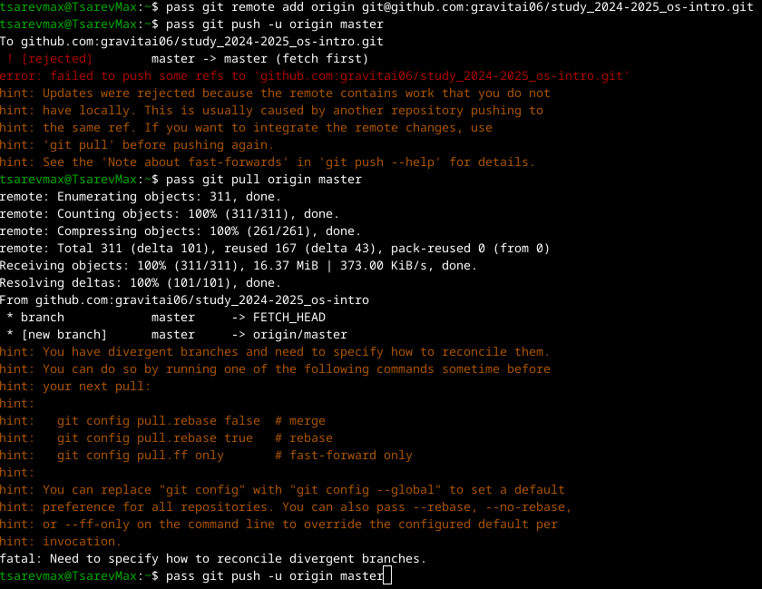{ #fig:006 width=70% }

## синхронизация с гитом

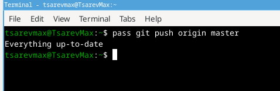{ #fig:007 width=70% }

## установка browserpass

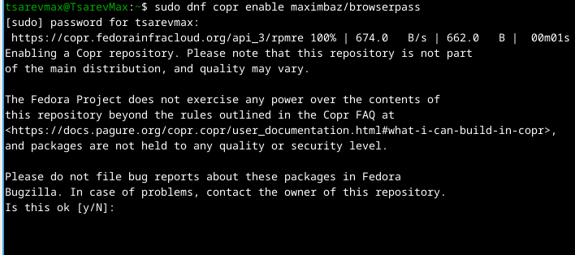{ #fig:008 width=70% }

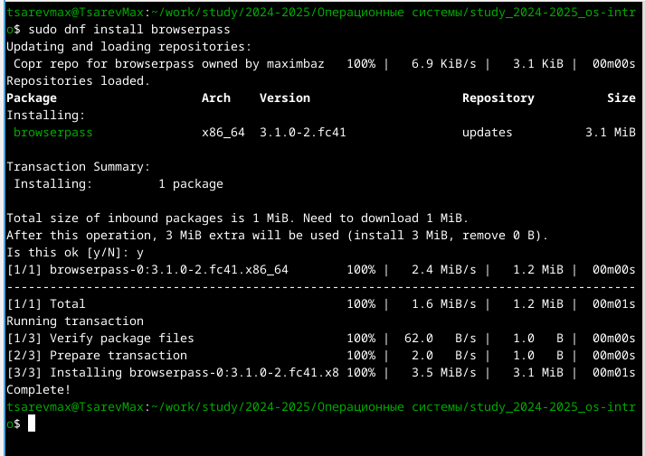{ #fig:009 width=70% }

## добавляю новый пароль

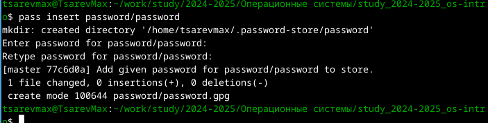{ #fig:010 width=70% }

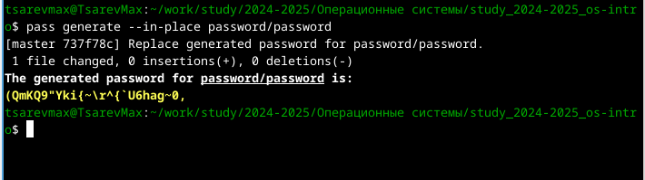{ #fig:011 width=70% }

## Установка дополнительного программного обеспечения

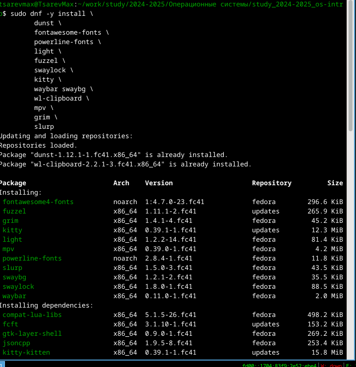{ #fig:012 width=70% }

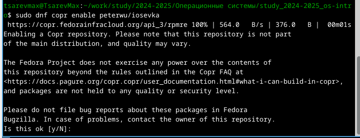{ #fig:013 width=70% }

## Установим бинарный файл. Создадим собственный репозиторий с помощью утилит Создадим свой репозиторий для конфигурационных файлов на основе шаблона: Инициализируем chezmoi с репозиторием dotfiles: Проверим, какие изменения внесёт chezmoi в домашний каталог. Запустим: chezmoi apply -v 

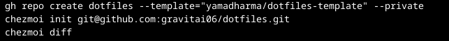{ #fig:014 width=70% }

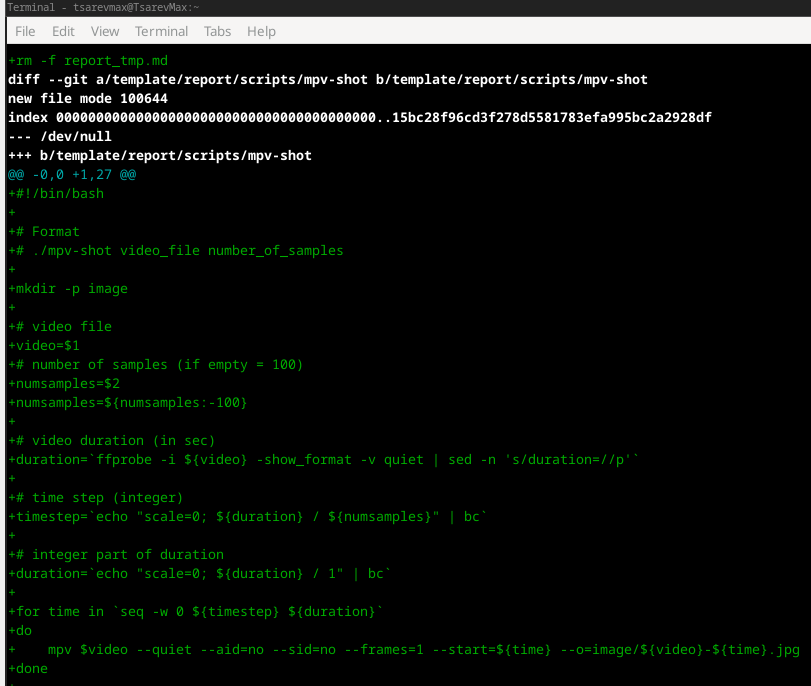{ #fig:015 width=70% }

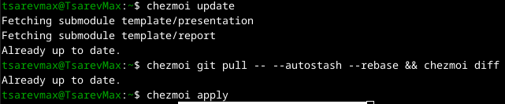{ #fig:016 width=70% }

## Можно автоматически фиксировать и отправлять изменения в исходный каталог в репозиторий. Эта функция отключена по умолчанию. Чтобы включить её, добавим в файл конфигурации ~/.config/chezmoi/chezmoi.toml следущие строки

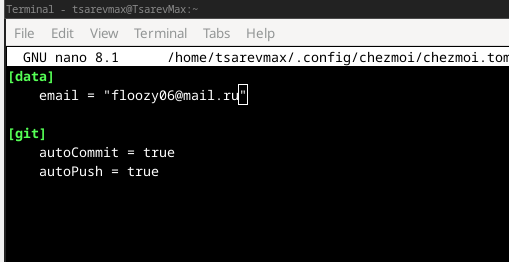{ #fig:017 width=70% }

## Вывод 

Мы познакомились с pass, gopass, native messaging, chezmoi. Научились пользоваться этими утилитами, синхронизировали их с гит.
