---
## Front matter
title: "Шаблон отчёта по лабораторной работе"
subtitle: "Простейший вариант"
author: "Дмитрий Сергеевич Кулябов"

## Generic otions
lang: ru-RU
toc-title: "Содержание"

## Bibliography
bibliography: bib/cite.bib
csl: pandoc/csl/gost-r-7-0-5-2008-numeric.csl

## Pdf output format
toc: true # Table of contents
toc-depth: 2
lof: true # List of figures
lot: true # List of tables
fontsize: 12pt
linestretch: 1.5
papersize: a4
documentclass: scrreprt
## I18n polyglossia
polyglossia-lang:
  name: russian
  options:
	- spelling=modern
	- babelshorthands=true
polyglossia-otherlangs:
  name: english
## I18n babel
babel-lang: russian
babel-otherlangs: english
## Fonts
mainfont: IBM Plex Serif
romanfont: IBM Plex Serif
sansfont: IBM Plex Sans
monofont: IBM Plex Mono
mathfont: STIX Two Math
mainfontoptions: Ligatures=Common,Ligatures=TeX,Scale=0.94
romanfontoptions: Ligatures=Common,Ligatures=TeX,Scale=0.94
sansfontoptions: Ligatures=Common,Ligatures=TeX,Scale=MatchLowercase,Scale=0.94
monofontoptions: Scale=MatchLowercase,Scale=0.94,FakeStretch=0.9
mathfontoptions:
## Biblatex
biblatex: true
biblio-style: "gost-numeric"
biblatexoptions:
  - parentracker=true
  - backend=biber
  - hyperref=auto
  - language=auto
  - autolang=other*
  - citestyle=gost-numeric
## Pandoc-crossref LaTeX customization
figureTitle: "Рис."
tableTitle: "Таблица"
listingTitle: "Листинг"
lofTitle: "Список иллюстраций"
lotTitle: "Список таблиц"
lolTitle: "Листинги"
## Misc options
indent: true
header-includes:
  - \usepackage{indentfirst}
  - \usepackage{float} # keep figures where there are in the text
  - \floatplacement{figure}{H} # keep figures where there are in the text
---

# Цель работы

Познакомиться с pass, gopass, native messaging, chezmoi. Научиться пользоваться этими утилитами, синхронизировать их с гит.

# Задание

1. Установить дополнительное ПО
2. Установить и настроить pass
3. Настроить интерфейс с браузером
4. Сохранить пароль
5. Установить и настроить chezmoi
6. Настроить chezmoi на новой машине
7. Выполнить ежедневные операции с chezmoi

# Теоретическое введение

Менеджер паролей pass — программа, сделанная в рамках идеологии Unix. Также носит название стандартного менеджера паролей для Unix (The standard Unix password manager). 1.1 Основные свойства Данные хранятся в файловой системе в виде каталогов и файлов. Файлы шифруются с помощью GPG-ключа. 1.2 Структура базы паролей Структура базы может быть произвольной, если Вы собираетесь использовать её напрямую, без промежуточного программного обеспечения. Тогда семантику структуры базы данных Вы держите в своей голове. Если же необходимо использовать дополнительное программное обеспечение, необходимо семантику заложить в структуру базы паролей. chezmoi используется для управления файлами конфигурации домашнего каталога пользователя. Конфигурация chezmoi 2.2.1 Рабочие файлы Состояние файлов конфигурации сохраняется в каталоге ~/.local/share/chezmoi. Он является клоном вашего репозитория dotfiles. Файл конфигурации ~/.config/chezmoi/chezmoi.toml (можно использовать также JSON или YAML) специфичен для локальной машины. Файлы, содержимое которых одинаково на всех ваших машинах, дословно копируются из исходного каталога. Файлы, которые варьируются от машины к машине, выполняются как шаблоны, обычно с использованием данных из файла конфигурации локальной машины для настройки конечного содержимого, специфичного для локальной машины.

# Выполнение лабораторной работы

установка pass

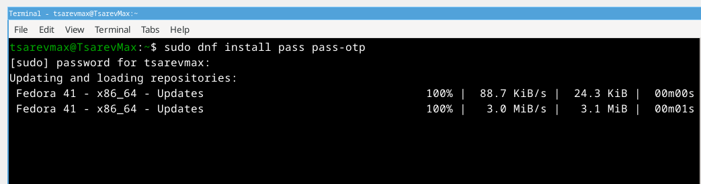{ #fig:001 width=70% }

установка gopass

{ #fig:002 width=70% }

Проверка существующих ключей

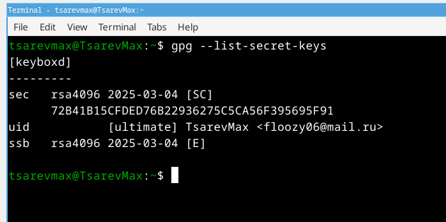{ #fig:003 width=70% }

инициализация хранилища

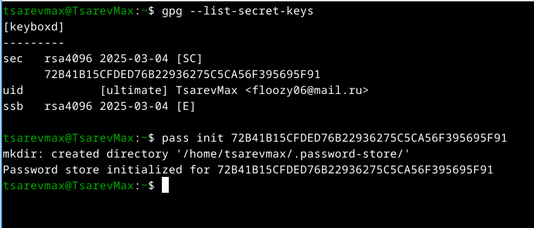{ #fig:004 width=70% }

создание структуры Гит

{ #fig:005 width=70% }

предаварительно создал репозиторий на гите

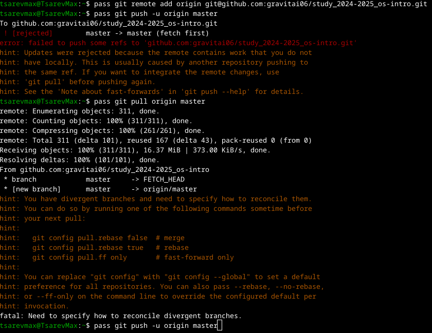{ #fig:006 width=70% }

синхронизация с гитом

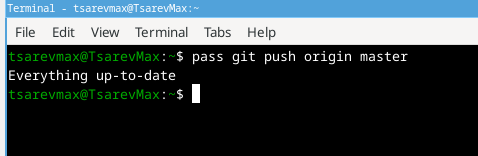{ #fig:007 width=70% }

установка browserpass

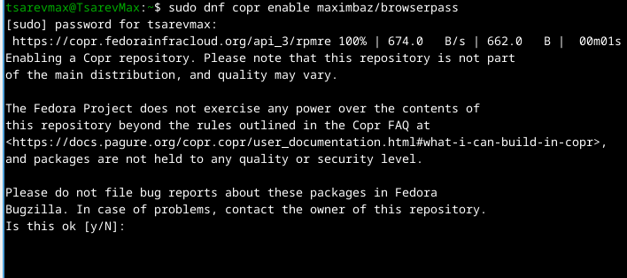{ #fig:008 width=70% }

{ #fig:009 width=70% }

добавляю новый пароль

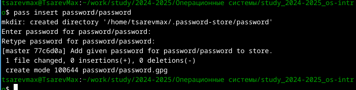{ #fig:010 width=70% }

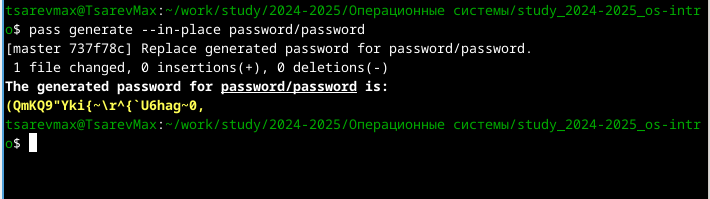{ #fig:011 width=70% }

Установка дополнительного программного обеспечения

{ #fig:012 width=70% }

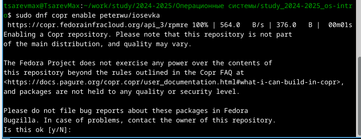{ #fig:013 width=70% }

Установим бинарный файл. Создадим собственный репозиторий с помощью утилит Создадим свой репозиторий для конфигурационных файлов на основе шаблона: Инициализируем chezmoi с репозиторием dotfiles: Проверим, какие изменения внесёт chezmoi в домашний каталог. Запустим: chezmoi apply -v 

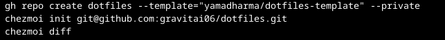{ #fig:014 width=70% }

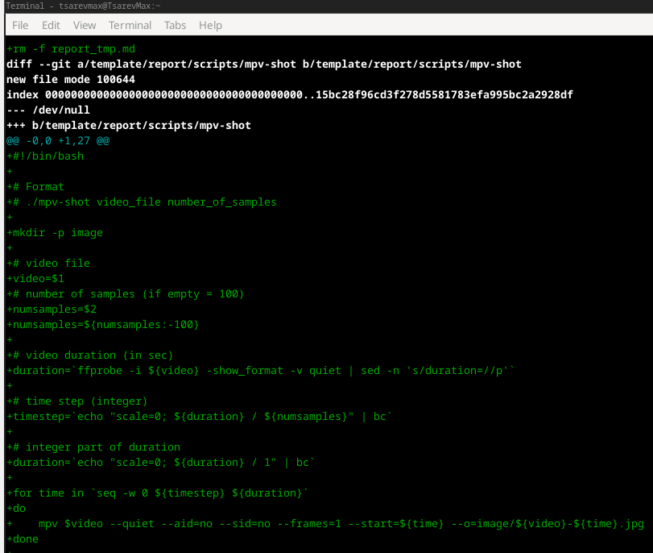{ #fig:015 width=70% }

{ #fig:016 width=70% }

Можно автоматически фиксировать и отправлять изменения в исходный каталог в репозиторий. Эта функция отключена по умолчанию. Чтобы включить её, добавим в файл конфигурации ~/.config/chezmoi/chezmoi.toml следущие строки

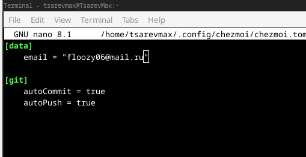{ #fig:017 width=70% }

# Вывод 

Мы познакомились с pass, gopass, native messaging, chezmoi. Научились пользоваться этими утилитами, синхронизировали их с гит.
