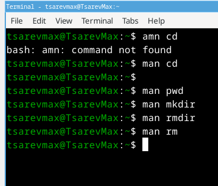

---
## Front matter
lang: ru-RU
title: Структура научной презентации
subtitle: Простейший шаблон
author:
  - Tsarev Maksim
institute:
  - Российский университет дружбы народов, Москва, Россия
  - Объединённый институт ядерных исследований, Дубна, Россия
date: 01 января 1970

## i18n babel
babel-lang: russian
babel-otherlangs: english

## Formatting pdf
toc: false
toc-title: Содержание
slide_level: 2
aspectratio: 169
section-titles: true
theme: metropolis
header-includes:
 - \metroset{progressbar=frametitle,sectionpage=progressbar,numbering=fraction}
---

## Цель работы

Приобритение практических навыков взаимодействия пользователя с системой посредством команндной строки

## Выполнение лабораторной работы

Определение полного имени дом. каталога

{ #fig:001 width=70% }

## перехожу в каталог и вывожу содержимое а после проверябю наличие подкотолга cron

{ #fig:002 width=70% }

## возвращаюсь обратно и вывожу все содержимое

{ #fig:003 width=70% }

## создал каталог, потом перешел в него и создал там еще один

{ #fig:004 width=70% }

## вернулся в домашнию директорию и создал сразу 3 папки и проверил наличие, а после удалил тоже сразу 3 папки

{ #fig:005 width=70% }

## попытался удалить папку но так удалять неправильно

Надо сначала удалить внутренее

{ #fig:006 width=70% }

## Посмотрел справку о команде ls

{ #fig:007 width=70% }

## сделал сортирвку по времени изменения

{ #fig:008 width=70% }

## потом посмотрел описание всех остальных команд

{ #fig:009 width=70% }

## посмотрел историю команд и повторил исползую !номер  

{ #fig:010 width=70% }

## Выводы

Я приобрел навыки работы с системой командной строки
