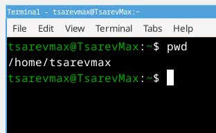
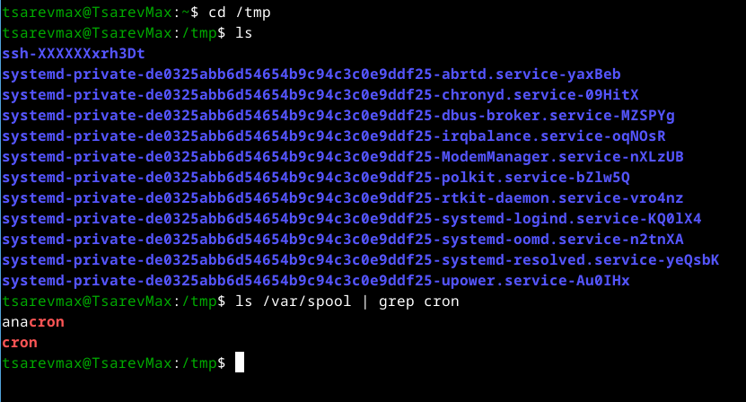
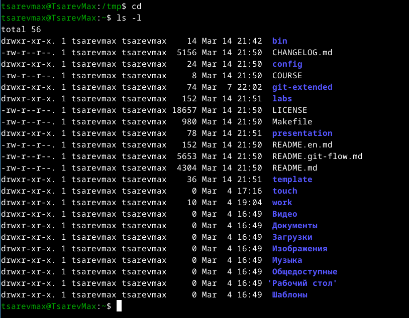
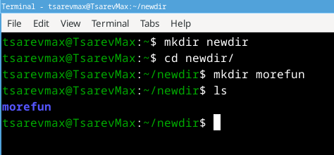
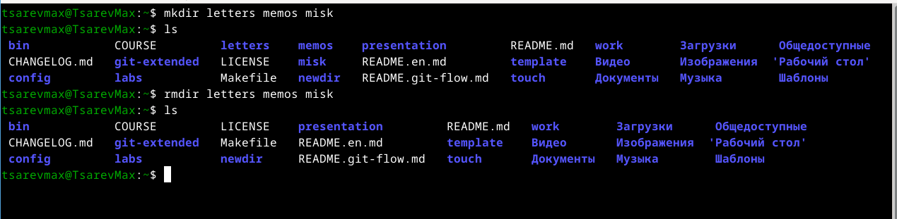
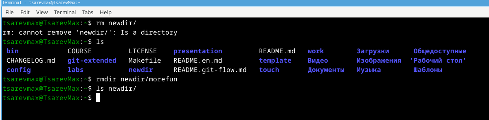
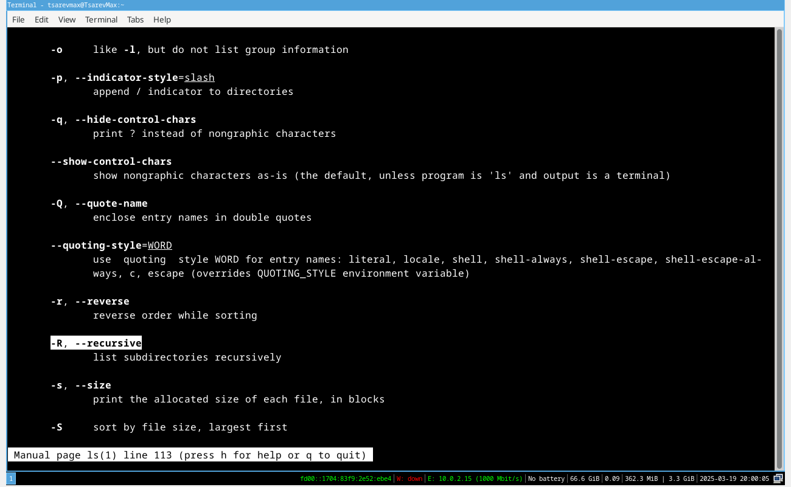
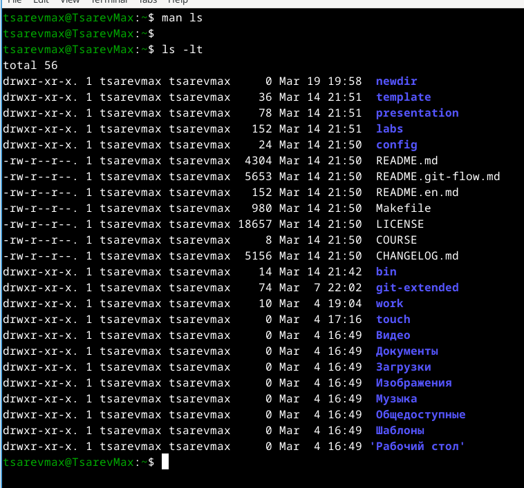
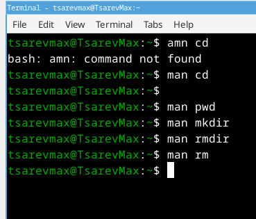
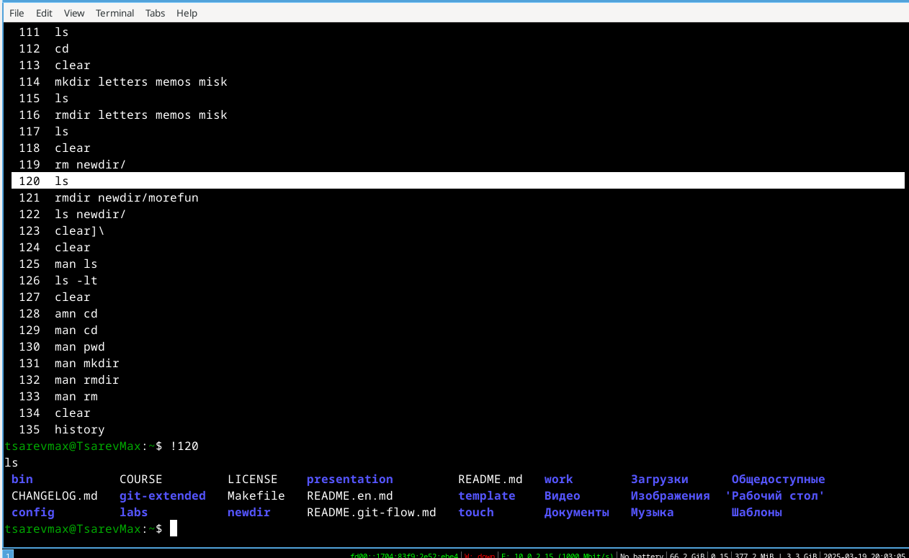

---
## Front matter
title: "отчёт по лабораторной работе №6"
subtitle: "Простейший вариант"
author: "Царёв Максим Александрович"

## Generic otions
lang: ru-RU
toc-title: "Содержание"

## Bibliography
bibliography: bib/cite.bib
csl: pandoc/csl/gost-r-7-0-5-2008-numeric.csl

## Pdf output format
toc: true # Table of contents
toc-depth: 2
lof: true # List of figures
lot: true # List of tables
fontsize: 12pt
linestretch: 1.5
papersize: a4
documentclass: scrreprt
## I18n polyglossia
polyglossia-lang:
  name: russian
  options:
	- spelling=modern
	- babelshorthands=true
polyglossia-otherlangs:
  name: english
## I18n babel
babel-lang: russian
babel-otherlangs: english
## Fonts
mainfont: IBM Plex Serif
romanfont: IBM Plex Serif
sansfont: IBM Plex Sans
monofont: IBM Plex Mono
mathfont: STIX Two Math
mainfontoptions: Ligatures=Common,Ligatures=TeX,Scale=0.94
romanfontoptions: Ligatures=Common,Ligatures=TeX,Scale=0.94
sansfontoptions: Ligatures=Common,Ligatures=TeX,Scale=MatchLowercase,Scale=0.94
monofontoptions: Scale=MatchLowercase,Scale=0.94,FakeStretch=0.9
mathfontoptions:
## Biblatex
biblatex: true
biblio-style: "gost-numeric"
biblatexoptions:
  - parentracker=true
  - backend=biber
  - hyperref=auto
  - language=auto
  - autolang=other*
  - citestyle=gost-numeric
## Pandoc-crossref LaTeX customization
figureTitle: "Рис."
tableTitle: "Таблица"
listingTitle: "Листинг"
lofTitle: "Список иллюстраций"
lotTitle: "Список таблиц"
lolTitle: "Листинги"
## Misc options
indent: true
header-includes:
  - \usepackage{indentfirst}
  - \usepackage{float} # keep figures where there are in the text
  - \floatplacement{figure}{H} # keep figures where there are in the text
---

# Цель работы

Приобритение практических навыков взаимодействия пользователя с системой посредством команндной строки

# Выполнение лабораторной работы

Определение полного имени дом. каталога

{ #fig:001 width=70% }

перехожу в каталог и вывожу содержимое а после проверябю наличие подкотолга cron

{ #fig:002 width=70% }

возвращаюсь обратно и вывожу все содержимое

{ #fig:003 width=70% }

создал каталог, потом перешел в него и создал там еще один 

{ #fig:004 width=70% }

вернулся в домашнию директорию и создал сразу 3 папки и проверил наличие, а после удалил тоже сразу 3 папки

{ #fig:005 width=70% }

попытался удалить папку но так удалять неправильно

Надо сначала удалить внутренее 

{ #fig:006 width=70% }

Посмотрел справку о команде ls

{ #fig:007 width=70% }

сделал сортирвку по времени изменения

{ #fig:008 width=70% }

потом посмотрел описание всех остальных команд

{ #fig:009 width=70% }

посмотрел историю команд и повторил исползую !номер  

{ #fig:010 width=70% }

# Выводы

Я приобрел навыки работы с системой командной строки

