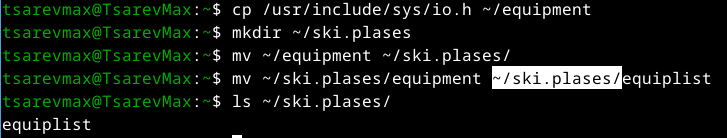

---
## Front matter
lang: ru-RU
title: Структура научной презентации
subtitle: Простейший шаблон
author:
  - Tsarev Maksim
institute:
  - Российский университет дружбы народов, Москва, Россия
  - Объединённый институт ядерных исследований, Дубна, Россия
date: 01 января 1970

## i18n babel
babel-lang: russian
babel-otherlangs: english

## Formatting pdf
toc: false
toc-title: Содержание
slide_level: 2
aspectratio: 169
section-titles: true
theme: metropolis
header-includes:
 - \metroset{progressbar=frametitle,sectionpage=progressbar,numbering=fraction}
---

## Цель работы

Ознакомление с файловой системой Linux, работа с файлами и >

## Выполнение лабораторной работы

##Копирование файла из /usr/include/sys/ в домашний каталог
Создание каталога ski.plases
 Перемещение файла equipment в ski.plases
Переименование файла equipment в equiplist

{ #fig:001 width=70% }

## Создание файла abc1 и его копирование
Создание каталога equipment внутри ski.plases
 Перемещение файлов equiplist и equiplist2 в equipment

{ #fig:002 width=70% }

## Создание и перемещение каталога newdir в plans

{ #fig:003 width=70% }

## Права drwxr--r-- для каталога australia
Права drwx--x--x для каталога play
Права -r-xr--r-- для файла my_os
Права -rw-rw-r-- для файла feathers

{ #fig:004 width=70% }

## Просмотр /etc/passwd

{ #fig:005 width=70% }

## Копирование feathers в file.old
Перемещение file.old в play
Копирование каталога play в fun
Перемещение fun в play с переименованием в games

{ #fig:006 width=70% }

## Запрет чтения для владельца feathers
Попытка просмотра feathers через cat
Попытка копирования feathers
Возврат права на чтение владельцу

{ #fig:007 width=70% }

## Запрет выполнения для каталога play
 Попытка перехода в play
 Возврат права на выполнение

{ #fig:008 width=70% }

## Выводы

В ходе работы освоены основные команды Linux для работы с ф>

