---
## Front matter
lang: ru-RU
title: Структура научной презентации
subtitle: Простейший шаблон
author:
  - Tsarev Maksim
institute:
  - Российский университет дружбы народов, Москва, Россия
  - Объединённый институт ядерных исследований, Дубна, Россия
date: 01 января 1970

## i18n babel
babel-lang: russian
babel-otherlangs: english

## Formatting pdf
toc: false
toc-title: Содержание
slide_level: 2
aspectratio: 169
section-titles: true
theme: metropolis
header-includes:
 - \metroset{progressbar=frametitle,sectionpage=progressbar,numbering=fraction}
---

## Цель работы

Освоение встроенного редактора Midnight Commander (mc)

## Выполнение лабораторной работы

Сначала скачиваю через консольную команду mc и после создаю файл для будущей работы

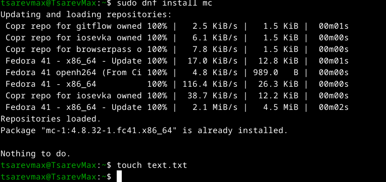{ #fig:001 width=70% }

## открыл файл в редакторе

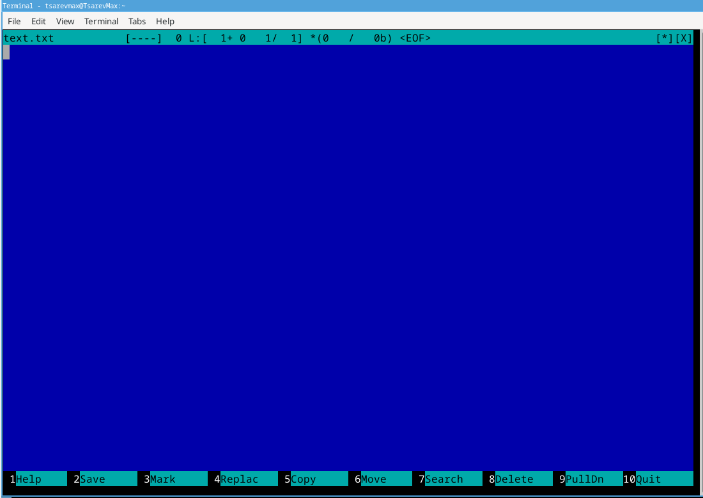{ #fig:002 width=70% }

##Вставил рандомный текст

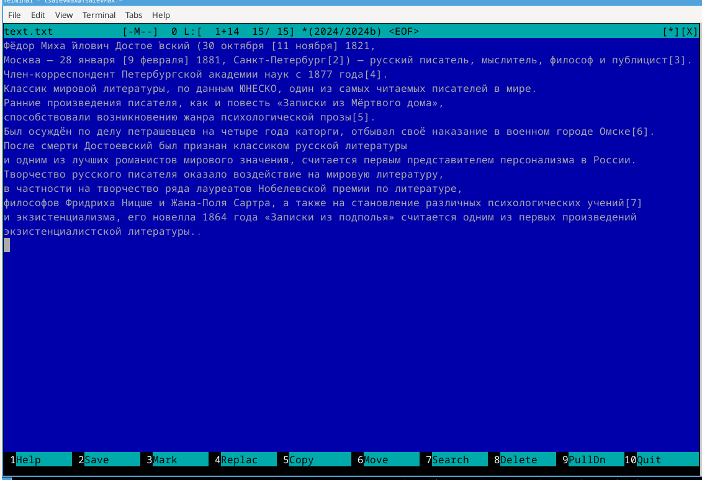{ #fig:003 width=70% }

## Удаление строки:

    Ctrl + Y — удалить текущую строку.

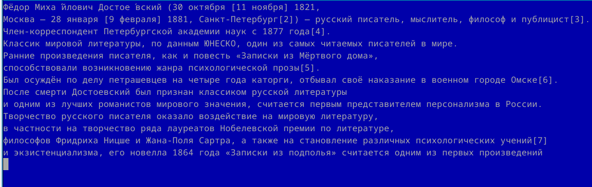{ #fig:004 width=70% }

## Выделение:

    Ctrl + \ → стрелками выделите текст → Enter.

## Копирование:

    F5 → Enter.

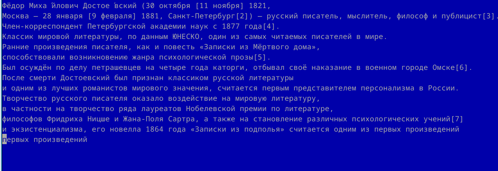{ #fig:005 width=70% }

## Сохранение:

    F2.

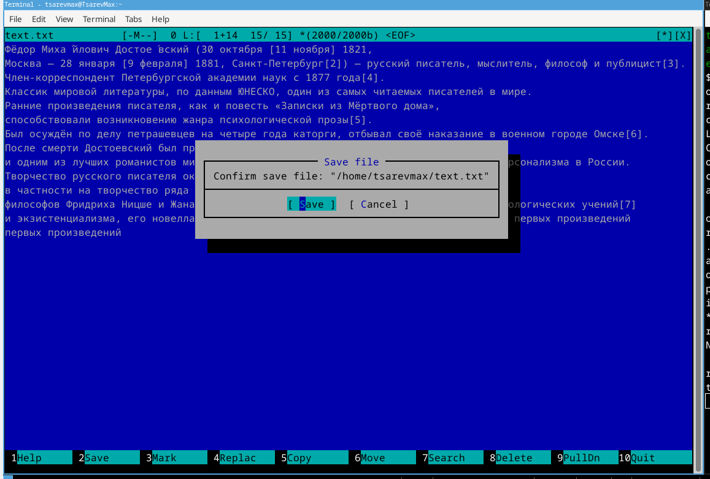{ #fig:006 width=70% }

## Отмена действия:

    Ctrl + U.

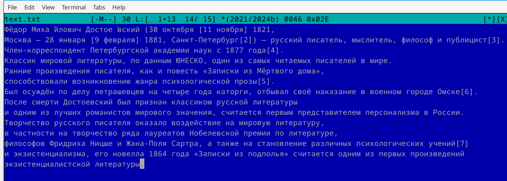{ #fig:007 width=70% }

## Переход в конец файла + текст:

    Ctrl + End

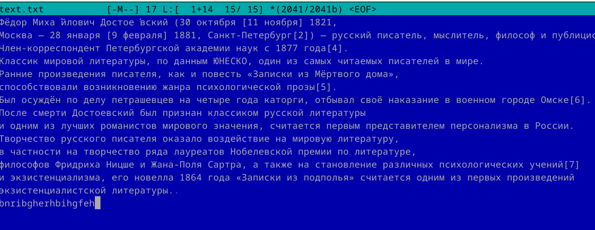{ #fig:008 width=70% }

## Переход в начало файла + текст:

    Ctrl + Home

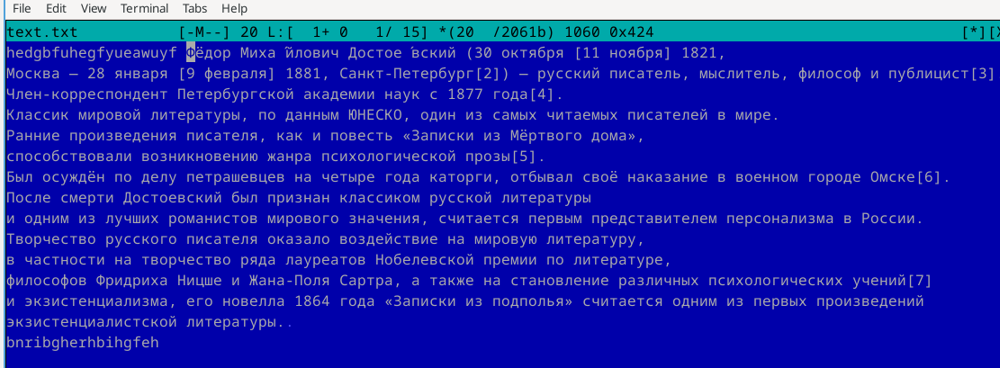{ #fig:009 width=70% }

## Сохранение и выход:

    F2 → F10

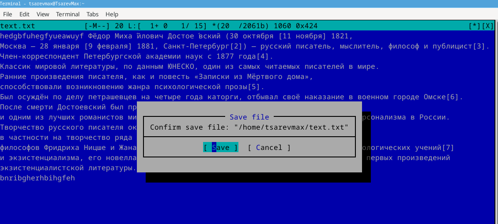{ #fig:010 width=70% }

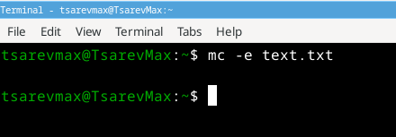{ #fig:011 width=70% }

## Выводы

Работа позволяет приобрести практические навыки редактирования файлов в mc, что полезно при администрировании серверов и работе в Linux без графической оболочки