---
## Front matter
title: "Отчёт по лабораторной работе"
subtitle: "Простейший вариант"
author: "Царёв Максим Адекасндрович"

## Generic otions
lang: ru-RU
toc-title: "Содержание"

## Bibliography
bibliography: bib/cite.bib
csl: pandoc/csl/gost-r-7-0-5-2008-numeric.csl

## Pdf output format
toc: true # Table of contents
toc-depth: 2
lof: true # List of figures
lot: true # List of tables
fontsize: 12pt
linestretch: 1.5
papersize: a4
documentclass: scrreprt
## I18n polyglossia
polyglossia-lang:
  name: russian
  options:
	- spelling=modern
	- babelshorthands=true
polyglossia-otherlangs:
  name: english
## I18n babel
babel-lang: russian
babel-otherlangs: english
## Fonts
mainfont: IBM Plex Serif
romanfont: IBM Plex Serif
sansfont: IBM Plex Sans
monofont: IBM Plex Mono
mathfont: STIX Two Math
mainfontoptions: Ligatures=Common,Ligatures=TeX,Scale=0.94
romanfontoptions: Ligatures=Common,Ligatures=TeX,Scale=0.94
sansfontoptions: Ligatures=Common,Ligatures=TeX,Scale=MatchLowercase,Scale=0.94
monofontoptions: Scale=MatchLowercase,Scale=0.94,FakeStretch=0.9
mathfontoptions:
## Biblatex
biblatex: true
biblio-style: "gost-numeric"
biblatexoptions:
  - parentracker=true
  - backend=biber
  - hyperref=auto
  - language=auto
  - autolang=other*
  - citestyle=gost-numeric
## Pandoc-crossref LaTeX customization
figureTitle: "Рис."
tableTitle: "Таблица"
listingTitle: "Листинг"
lofTitle: "Список иллюстраций"
lotTitle: "Список таблиц"
lolTitle: "Листинги"
## Misc options
indent: true
header-includes:
  - \usepackage{indentfirst}
  - \usepackage{float} # keep figures where there are in the text
  - \floatplacement{figure}{H} # keep figures where there are in the text
---

# Цель работы

Освоение встроенного редактора Midnight Commander (mc)

# Выполнение лабораторной работы

Сначала скачиваю через консольную команду mc и после создаю файл для будущей работы

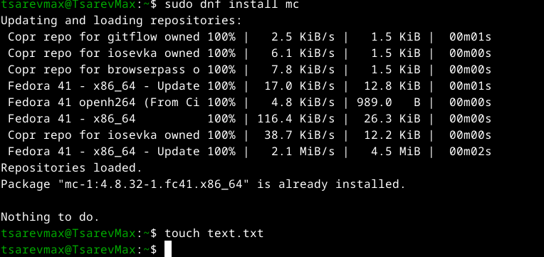{ #fig:001 width=70% }

открыл файл в редакторе

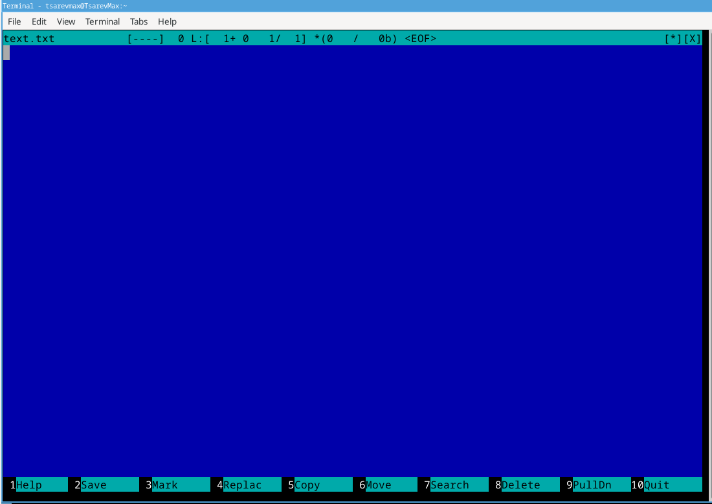{ #fig:002 width=70% }

Вставил рандомный текст 

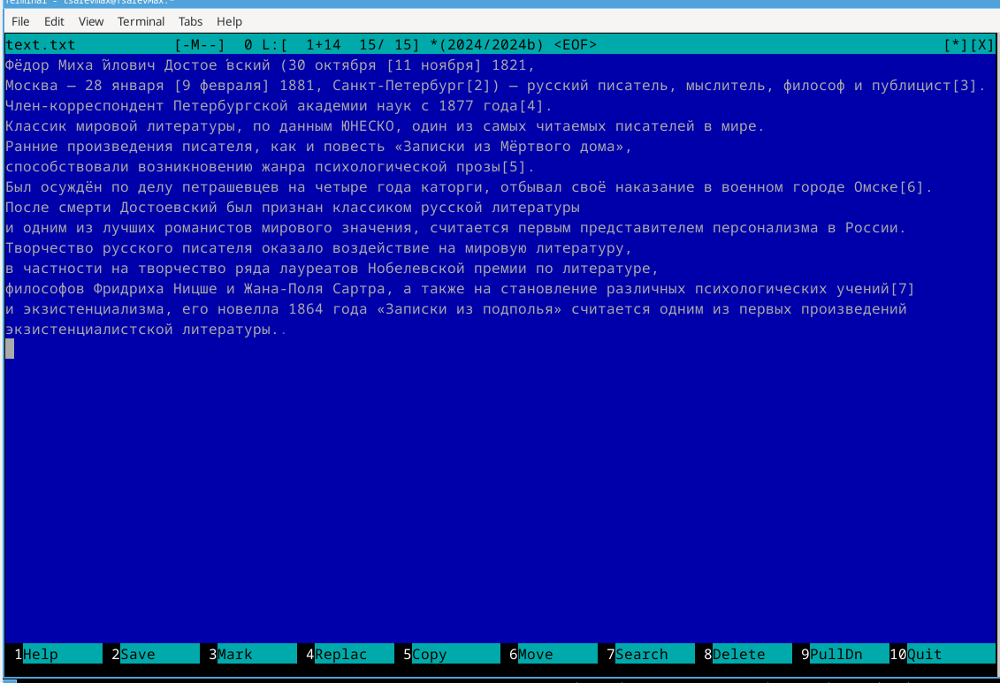{ #fig:003 width=70% }

 Удаление строки:

    Ctrl + Y — удалить текущую строку.

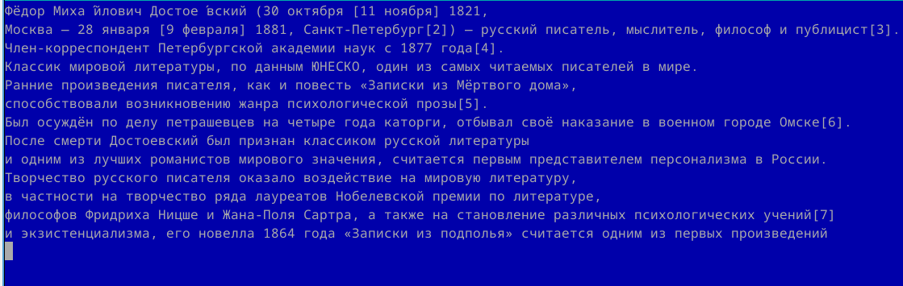{ #fig:004 width=70% }

Выделение:

    Ctrl + \ → стрелками выделите текст → Enter.

Копирование:

    F5 → Enter.

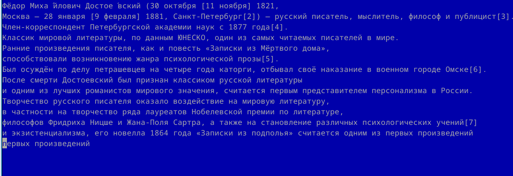{ #fig:005 width=70% }

 Сохранение:

    F2.

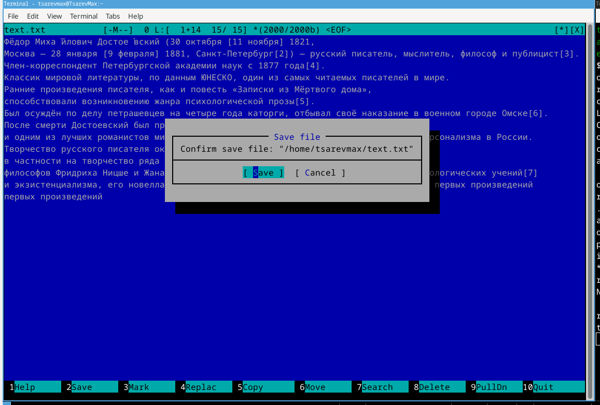{ #fig:006 width=70% }

 Отмена действия:

    Ctrl + U.

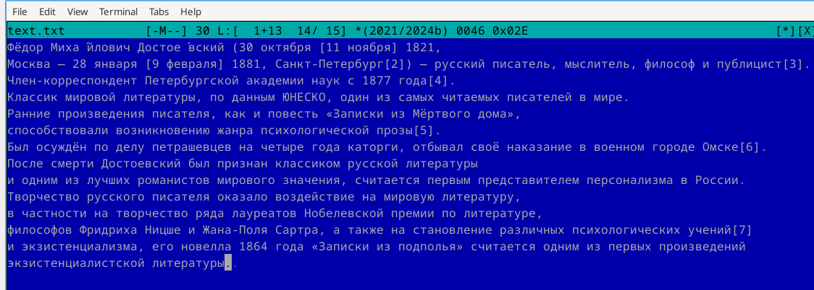{ #fig:007 width=70% }

. Переход в конец файла + текст:

    Ctrl + End

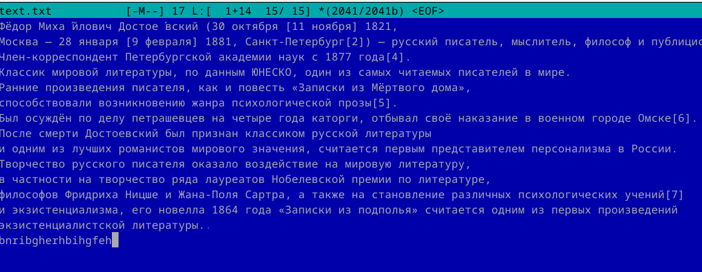{ #fig:008 width=70% }

Переход в начало файла + текст:

    Ctrl + Home

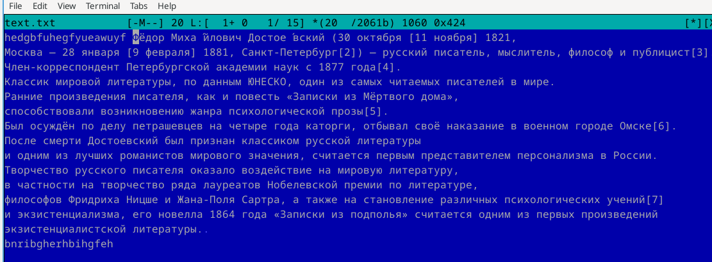{ #fig:009 width=70% }

Сохранение и выход:

    F2 → F10

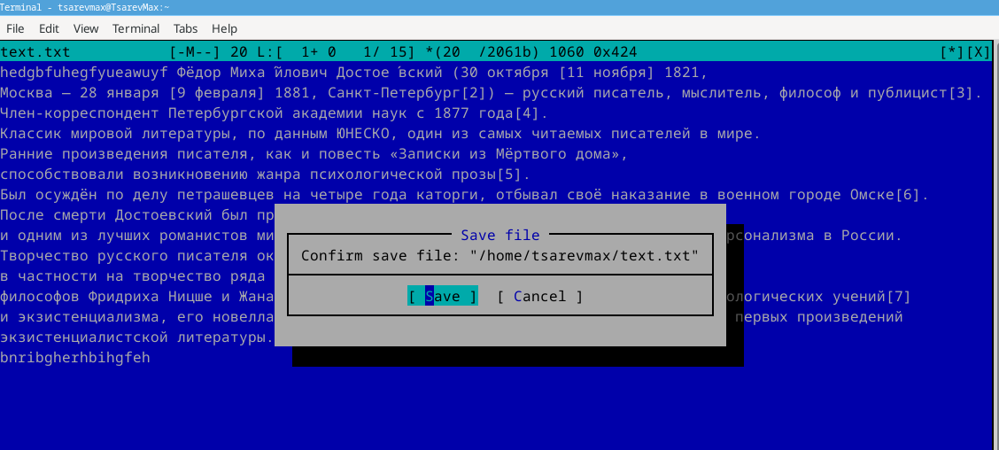{ #fig:010 width=70% }

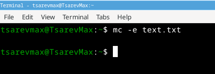{ #fig:011 width=70% }

# Выводы

Работа позволяет приобрести практические навыки редактирования файлов в mc, что полезно при администрировании серверов и работе в Linux без графической оболочки